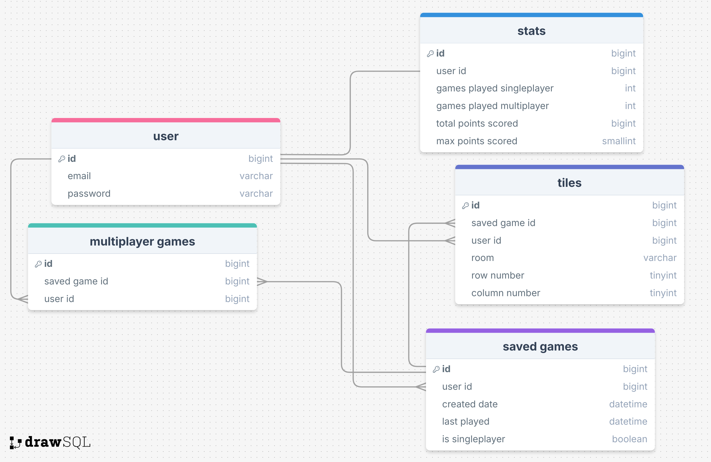

# Project Title
Check-In

## Overview

Check-In is a strategic turn-based game where players place tiles on their board aiming to get the maximum amount of points.

### Problem Space

There already exist similar turn-based boardgames (eg. Azul, Cascadia) but there are none designed specifically for the web.

### User Profile

Boardgame enthusiasts who either want solo challenges or a platform that allows them to play with friends living far away.

### Features

- As a user, I want to be able to play Check-In alone.
- As a user, I want to know my final score at the end of a game of Check-In.

- As a user, I want to be able to create an account to manage my statsistics and to connect with others.
- As a user, I want to be able to login to my account to manage my statistics and to connect with others.

- As a logged in user, I want to be able to play Check-In with others.
- As a logged in user, I want to be able to see the statistics of my past games.
- As a logged in user, I want to be able to save a game and return to it at a later date.

## Implementation

### Tech Stack

- React
- TypeScript
- MySQL
- Express
- Client libraries: 
    - react
    - react-router
    - axios
    - motion.dev
- Server libraries:
    - knex
    - express
    - websockets
    - bcrypt for password hashing?


### APIs

No external APIs will be used for the first sprint.

### Sitemap

- Homepage
- Gameplay
- Stats
- Login
- Register

### Mockups

Please see feature/singleplayer branch for current design ideas.

### Data



### Endpoints

**GET /stats**

- Get statistics for a user

Parameters:
- JWT token for authentification of logged in user

Response:
```
{
    "user id": 1,
    "singleplayer games": 1,
    "multiplayer games": 2,
    "total points": 200
    "max points": 89
}
```

**PUT /stats**

- Update statistics for a user

Parameters:
- JWT token for authentification of logged in user
- Singleplayer games (total number played)
- Multiplayer games (total number played)
- Total points (total points scored throughout all games)
- Max points (maximum score in one single game)

Response:
```
{
    "id": 1,
    "singleplayer_games": 1,
    "multiplayer_games": 2,
    "total_points": 200
    "max_points": 89
}
```

**GET /games**

- Get all saved games for a user

Parameters:
- JWT token for authentification of logged in user

Response:
```
[
    {
        "id": 1
        "user_id": 1
        "last played": 11/25/2024 11:59pm
        "created date": 11/21/2024 12:01am
        "is_singleplayer": true
    },
    ...
]
```

**POST /games**

- Save new singleplayer game

Parameters:
- JWT token for authentification of logged in user

Response:
```
{
    "id": 1
    "user_id": 1
    "is_singleplayer": true
}
```

**PUT /games/:id**

- Save new singleplayer game which was already saved (this is only to change the updated_at column of the game)

Parameters:
- JWT token for authentification of logged in user
- Game ID

Response:
```
{
    "id": 1
    "user_id": 1
    "is_singleplayer": true
}
```

**DELETE /games/:id**

- Delete singleplayer game if user wants or when game is over

Parameters:
- JWT token for authentification of logged in user
- Game ID

No response

**GET /tiles/:gameId**

- Get all tiles for a specific game ID

Parameters:
- JWT token for authentification of logged in user
- Game ID

Response:
```
{
    "game_id": 1
    "user_id": 1
    "tiles": [{room: lobby, row: 2, column: 2}, ...]
}
```

**POST /tiles/:gameId**

- Save tiles for a game

Parameters:
- JWT token for authentification of logged in user
- Game ID
- Array of tile objects (room, row, column)

Response:
```
{
    "game_id": 1
    "user_id": 1
    "tiles": [{room: lobby, row: 2, column: 2}, ...]
}
```

**PUT /tiles/:gameid**

- Save tiles for a game that was already saved

Parameters:
- JWT token for authentification of logged in user
- Game ID
- Array of tile objects (room, row, column)

Response:
```
{
    "game_id": 1
    "user_id": 1
    "tiles": [{room: lobby, row: 2, column: 2}, ...]
}
```

**GET /multiplayer/:gameid**

- Get all users for a saved multiplayer game

Parameters:
- JWT token for authentification of logged in user (this would be the primary user -- the one who created and saved the game)
- Game ID

Response:
```
[
    1,
    2,
    ...
]
```

**POST /multiplayer/:gameid**

- Save users ID for a multiplayer game

Parameters:
- JWT token for authentification of logged in user (this would be the primary user -- the one who created and saved the game)
- Game ID
- User ID of each user in the game

Response:
```
[
    1,
    2,
    ...
]
```

**PUT /multiplayer/:gameid**

- Save users ID for a multiplayer game that was already saved

Parameters:
- JWT token for authentification of logged in user (this would be the primary user -- the one who created and saved the game)
- Game ID
- User ID of each user in the game

Response:
```
[
    1,
    2,
    ...
]
```

**POST /users/register**

- Add a user account

Parameters:

- email: User's email
- password: User's provided password

Response:
```
{
    "token": "seyJhbGciOiJIUzI1NiIsInR5cCI6IkpXVCJ9.eyJzdWIiOiIxMjM0NTY3ODkwIiwibmFtZSI6I..."
}
```

**POST /users/login**

- Login a user

Parameters:
- email: User's email
- password: User's provided password

Response:
```
{
    "token": "seyJhbGciOiJIUzI1NiIsInR5cCI6IkpXVCJ9.eyJzdWIiOiIxMjM0NTY3ODkwIiwibmFtZSI6I..."
}
```

### Auth

- JWT auth
    - Before adding auth, all API requests will be using a fake user with id 1
    - Added after core features have first been implemented
    - Store JWT in localStorage, remove when a user logs out
    - Add states for logged in showing different UI (specifically saving games, loading games, and seeing stats)

## Roadmap

- Create client

- Create server

- Create migrations

- Create seeds with sample data

- Deploy client and server projects so all commits will be reflected in production

- Feature: Singleplayer gameplay

- Feature: Login

- Feature: Stats page

- Feature: Multiplayer gameplay

- Feature: JWT Auth

- Bug fixes

- DEMO DAY

---

## Future Implementations

- Forgot password
- Implement more secure authorization (such as OAuth)
- More complex gameplay (complicate rules to make it more strategic)
- Implement comprehensive tutorial
- Allow for more than 2 players at a time
- In-game chat feature
- In-game friends (would make it easy to create a game with them)

